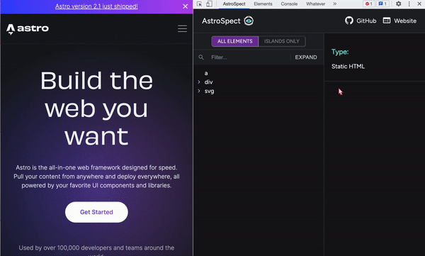

# AstroSpect

<a name="readme-top"></a>

<div align="center">

<!-- PROJECT LOGO -->
<br>
<div align="center">
  <a href="https://github.com/oslabs-beta/AstroSpect">
    
  </a>

  <h2 align="center">
    A Chrome DevTools Extension For Astro Developers
    <br>
    <a href="https://www.astrospect.dev/"><strong>Explore AstroSpect »</strong></a>
    <br>
    <a href="https://medium.com/@contact_33429/introducing-astrospect-4498d423b055"><strong>Read our Medium Article »</strong></a>
  </h2>
</div>
<br>

[![Contributors][contributors-shield]][contributors-url]
[![Forks][forks-shield]][forks-url]
[![Stargazers][stars-shield]][stars-url]
[![MIT License][license-shield]][license-url]
[![Issues][issues-shield]][issues-url]
[![LinkedIn][linkedin-shield]][linkedin-url]

<!-- [linkedin-url] -->

</div>

<!-- TABLE OF CONTENTS -->
<details>
  <summary>Table of Contents</summary>
  <ol>
    <li>
      <a href="#summary">Summary</a>
      <ul>
        <li><a href="#built-with">Built With</a></li>
      </ul>
    </li>
    <li>
      <a href="#getting-started">Getting Started</a>
      <ul>
        <li><a href="#prerequisites">Prerequisites</a></li>
        <li><a href="#installation">Installation</a></li>
        <li><a href="#usage">Usage</a></li>
      </ul>
    </li>
    <li><a href="#about">About</a></li>
        <ul>
        <li><a href="#astro">Astro</a></li>
      </ul>
    <li><a href="#roadmap">Roadmap</a></li>
    <li><a href="#contributions">Contributions</a></li>
    <li><a href="#acknowledgments">Acknowledgments</a></li>
            <ul>
        <li><a href="#community">Community</a></li>
                <li><a href="#authors">Authors</a></li>
      </ul>
  </ol>
</details>

<hr>

## Summary

AstroSpect (Astro Inspection) is a Chrome Developer Tool Extension that allows developers to inspect and debug Astro websites more efficiently. With AstroSpect, developers can display a tree diagram of all elements on a page, including static HTML files and hydrated components known as Astro Islands, on a panel. The "All Elements" tab shows all elements, while the "Islands Only" tab displays only Astro Islands. Clicking on an Astro Island reveals information about the component, such as its type, client directive, and props, in a side-pane. AstroSpect features expand and collapse options to open and close tree nodes and a search function for quicker navigation and debugging.

### - Built With

<div align='center'>

[![Astro][astro-shield]][astro-url]
[![React][react-shield]][react-url]
[![Sass][sass-shield]][sass-url]
[![TypeScript][typescript-shield]][typescript-url]
[![Webpack][webpack-shield]][webpack-url]

</div>
<hr>
<!-- GETTING STARTED -->

## Getting Started

AstroSpect is available for download as a Google Chrome Extension. You can also clone or fork this repo and add it as your own extension manually.

### - Prerequisites

- Chrome Browser
- Astro 2.0
- VS Code

### - Installation

Option 1: Download as a <a href="https://chrome.google.com/webstore/detail/astrospect/pfefekfhnmbfcofpjojnpmhdakcadeil">chrome extension</a>

Option 2: Manually Download

<ol>
<li>Fork or Clone this repo</li>
<li>In the terminal: npm run build</li>
<li>Navigate to chrome://extensions/</li>
<li>Click Load unpacked button</li>
<li>Upload the extension folder</li>
</ol>

### - Usage

1. Start or open an Astro project.
2. Inspect the Astro webpage
3. Open the AstroSpect Tab
4. "ALL ELEMENTS" displays every element on the page
5. "ISLANDS ONLY" displays hydrated components with client directives

<div align='center'>
<h3>Inspect</h3>


<h3>Expand & Collapse</h3>



<h3>Search</h3>


</div>

<hr>

## About

### - Astro

Astro is the all-in-one web framework designed for speed. Pull your content from anywhere and deploy everywhere, all powered by your favorite UI components and libraries. AstroSpect allow developers to inspect the Island Architecture of Astro websites in conjunction with other frameworks (React, Preact, Svelte, Vue, Solid, Lit and more). [Check out Astro to build your next website](https://astro.build/).

<hr>

## Roadmap

- [x] Inspect Astro Websites with AstroSpect Chrome Extension
- [x] Display all HTML elements in "All Elements" tab
- [x] Display Hydrated Components in "Islands Only" tab
- [x] Display Component's Type, Client Directive, and Props in side pane
- [x] Expand and Collapse feature opens and closes all tree nodes
- [x] Search feature highlights the inputted text
- [x] Tracking buttons that directs user to every highlighted word
- [ ] Auto-reload when navigating to a different page
- [ ] Display Framework associated with each island on side pane
- [ ] Access nanostores of all components
- [ ] Display state of components in side pane
- [ ] Highlight over islands when clicked in the panel
- [ ] Highlight over islands when clicked in the panel

Check out the [open issues](https://github.com/oslabs-beta/AstroSpect/issues) for a full list of proposed features (and known issues).

<hr>

## Contributions

All contributions are hightly welcomed and appreciated here at AstroSpect. We are open to suggestions so please submit an issue and the AstroSpect team will get back to you as soon as possible. If you would like to add a new feature, please follow the steps below.

#### STEP 1 — Fork and Clone the repository

```
git clone https://github.com/oslabs-beta/AstroSpect.git
```

#### STEP 2 — Create a Feature Branch

```
git checkout -b [name]/[feature-name]
```

#### STEP 3 — Install Dependencies

```
npm install
```

#### STEP 4 — Bundle the Code

```
npm run build
```

#### STEP 5 — Upload Extension Folder to Chrome

    1. Navigate to chrome://extensions/ using chrome
    2. Click Load unpacked button
    3. Upload extension folder
    4. Test Extension by inspecting an Astro webpage

#### STEP 6 — Add and Commit

```
git add [file-name]
git commit -m "describe your new feature"
```

#### STEP 7 — Submit a Pull Request

    Merge your feature branch into dev

#### STEP 8 — Create an Issue

    Click the Issues tab and create a new issue

<hr>

## Acknowledgments

### - Community

- [OpenSource Labs](https://opensourcelabs.io/)
- [Astro Discord](https://discord.com/invite/grF4GTXXYm)
- [AstroSpect Users](https://www.astrospect.dev/)

Distributed under the MIT License. See `LICENSE` for more information.

### - Authors

<table align="center">
  <tr>
    <td align="center">
      <h1>🧑🏻‍🚀</h1>
      <h4><strong>Evan Jones</h4>
      <a href="https://www.linkedin.com/in/evan-jones-dev/"></a>
      <br>
          <a href="https://github.com/evanjones125"></a>
    </td>
        <td align="center">
        <h1>🧑🏼‍🚀</h1>
      <h4><strong>Nicholas Park</h4>
      <a href="https://www.linkedin.com/in/parknicholas/"></a>
      <br>
          <a href="https://github.com/npark009"></a>
    </td>
        <td align="center"><h1>👨🏻‍🚀</h1>
      <h4><strong>John Roman</h4>
      <a href="https://www.linkedin.com/in/john-m-roman/"></a>
      <br>
          <a href="https://github.com/jm-roman"></a>
    </td>
        <td align="center"><h1>👩🏼‍🚀</h1>
      <h4><strong>Jackson Ta</h4>
      <a href="https://www.linkedin.com/in/jackson-ta/"></a>
      <br>
          <a href="https://github.com/Jackson2taLL"></a>
    </td>
    </tr>
  </table>

<p align="right">(<a href="#readme-top">back to top</a>)</p>

[github-shield]: https://img.shields.io/badge/-Github-808080?logo=github
[contributors-shield]: https://img.shields.io/github/contributors/oslabs-beta/AstroSpect?color=navy&label=Contributors
[contributors-url]: https://github.com/oslabs-beta/AstroSpect/graphs/contributors
[forks-shield]: https://img.shields.io/github/forks/oslabs-beta/AstroSpect?color=gold&label=Forks
[forks-url]: https://github.com/oslabs-beta/AstroSpect/forks
[stars-shield]: https://img.shields.io/github/stars/oslabs-beta/AstroSpect?color=%234B0082&label=Stars
[stars-url]: https://github.com/oslabs-beta/AstroSpect/stargazers
[issues-shield]: https://img.shields.io/github/issues/oslabs-beta/AstroSpect?color=%23483D8B&label=Issues
[issues-url]: https://github.com/oslabs-beta/AstroSpect/issues
[license-shield]: https://img.shields.io/github/license/oslabs-beta/AstroSpect?color=%09%23FF8C00&label=License
[license-url]: https://github.com/oslabs-beta/AstroSpect/blob/master/LICENSE
[linkedin-shield]: https://img.shields.io/badge/-LinkedIn-0072b1?logo=linkedin
[linkedin-url]: https://www.linkedin.com/company/astrospect
[astro-shield]: https://img.shields.io/badge/-ASTRO-4c00b0?logo=astro
[astro-url]: https://astro.build/
[react-shield]: https://img.shields.io/badge/-REACT-333333?logo=react
[react-url]: https://reactjs.org/
[sass-shield]: https://img.shields.io/badge/-SASS-FFC0CB?logo=sass
[sass-url]: https://sass-lang.com/
[typescript-shield]: https://img.shields.io/badge/-TYPESCRIPT-e6e6e6?logo=typescript
[typescript-url]: https://www.typescriptlang.org
[webpack-url]: https://webpack.js.org/
[webpack-shield]: https://img.shields.io/badge/-WEBPACK-1e3f66?logo=webpack
